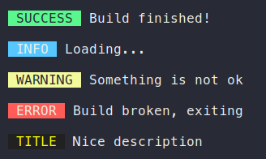

<p align="center">
  
  <h2 align="center">xa</h2>
  <p align="center">Simple console logger, that works in Node.js, Electron and the Browser :heart:<p>
  
<p align="center">  
<a href="https://travis-ci.org/xxczaki/xa"></a> <a href="https://github.com/sindresorhus/xo"></a> 
<a href="https://www.youtube.com/watch?v=9auOCbH5Ns4"></a>
  </p>
  
 
 <p align="center"></p>

## Installation

```
npm install xa
```

<a href="https://www.patreon.com/akepinski">
	
</a>

## Usage

```js
const xa = require('xa');

xa.success('Build finished!');
xa.custom('TITLE', 'Nice description', {titleColor: 'yellow', backgroundColor: '#212121'});
```

## API

## xa

Main method

### success(text)

**text**

Type: `string`

A text you want to display


### info(text)

**text**

Type: `string`

A text you want to display

### warning(text)

**text**

Type: `string`

A text you want to display

### error(text)

**text**

Type: `string`

A text you want to display

### custom(title, text, {titleColor, backgroundColor})

**title**

Type: `string`

Title of the log. When in Electron, the title will be either `MAIN` or `RENDERER`.

**text**

Type: `string`

A text you want to display

**titleColor**

Type: `string`
Default: `white`

Color of the title. It will be converted to HEX.

**backgroundColor**

Type: `string`
Default: `black`

Color of title's background. It will be converted to HEX.

## Thanks:

- [Jamen Marzonie](https://www.npmjs.com/~jamen) for providing package name!

## License

MIT © [Antoni Kepinski](https://kepinski.me)
